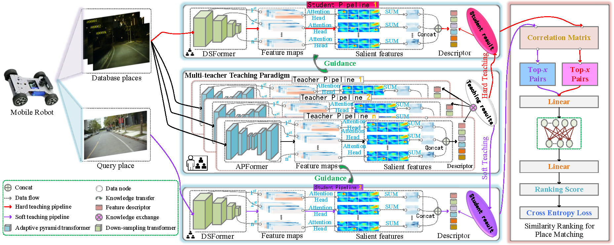
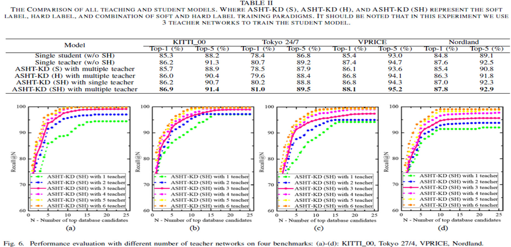

# ASHT-KD: Adaptive Soft-Hard Label Knowledge Distillation for Place Recognition

This repository implements the **ASHT-KD** framework for **Visual Place Recognition (VPR)** based on the paper *"Feature-Level Knowledge Distillation for Place Recognition based on Soft-Hard Labels Teaching Paradigm"*.




## Table of Contents
- [Introduction](#introduction)
- [Features](#features)
- [Installation](#installation)
- [Usage](#usage)
  - [Training](#training)
  - [Evaluation](#evaluation)

## Introduction
ASHT-KD is a multi-teacher knowledge distillation framework designed for robust all-day visual place recognition tasks. It incorporates soft and hard label teaching strategies to transfer knowledge from multiple teacher models to a lightweight student model, enabling efficient place recognition under various environmental conditions.
     
### Key Features:
- **Multi-teacher knowledge distillation**: Combines knowledge from multiple teacher models to improve the generalization of the student model.
- **Lightweight student model**: A compact model designed for mobile robots to enable real-time performance with minimal computational cost.
- **Feature-level distillation**: Leverages knowledge distillation at the feature level to ensure robust learning across varying illumination and environmental conditions.

## Features
- Multi-teacher and lightweight student model training.
- Adaptive soft-hard label teaching.
- Easy-to-use modular structure for training and evaluation.
- Flexible hyperparameter configurations for batch size, learning rate, and more.

## Installation
1. Clone the repository:
    ```bash
    git clone https://github.com/CV4RA/ASHT-KD.git
    cd ASHT-KD
    ```

2. Install dependencies:
    ```bash
    pip install -r requirements.txt
    ```

3. Ensure you have the necessary dataset (e.g., [KITTI](https://www.cvlibs.net/datasets/kitti/), [Tokyo 24/7](http://www.ok.ctrl.titech.ac.jp/~torii/project/247/), [VPRICE](), [Nordland](https://nrkbeta.no/2013/01/15/nordlandsbanen-minute-by-minute-season-by-season/)) available for training and evaluation.

## Usage

### Training

```bash
python main.py --mode train --data_dir /path/to/dataset --epochs 20 --batch_size 32
```
### Evaluation
```bash
python main.py --mode evaluate --data_dir /path/to/test/data --checkpoint /path/to/model/checkpoint
```
